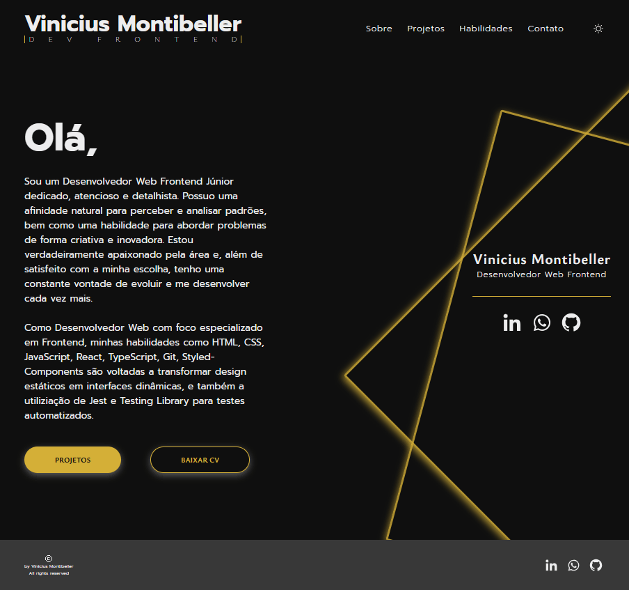
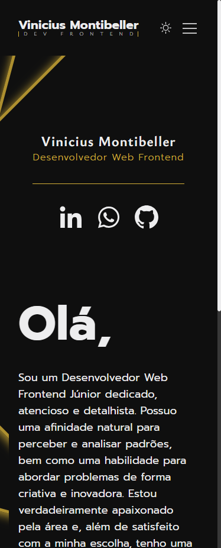

# Portfolio | Vinicius Montibeller

## Tabela de Conteúdos

- [Descrição](#descricao)
- [Screenshots](#screenshots)
- [Deploy](#deploy)
- [Tecnologias](#tecnologias)
- [Autor](#autor)
- [Agardecimentos](#agradecimentos)

## Descrição

Realizei esse projeto com a finalidade de guardar e mostrar minhas experiências e habilidades como Desenvolvedor Web Frontend.

Será constantemente atualizado conforme realizo novos projetos e aprendo novas technologias, assim, gravando minha evolução como desenvolvedor.

## Screenshots

- Versão desktop

- Versão Mobile

## Deploy

Link para a página do projeto: [Deploy através da vercel](https://portfolio-vinicius-montibeller.vercel.app/)

## Tecnologias

- HTML Semântico
- CSS Custom properties
- Flexbox
- [React](https://react.dev/) - JS Library
- [Styled-Components](https://styled-components.com/) - Para estilização
- [React-router-dom](https://reactrouter.com/en/main) - Controle de rotas
- [React-icons](https://react-icons.github.io/react-icons/)
- [React Hook Form](https://react-hook-form.com/) - Controle e validação de formulário
- [EmailJS](https://www.emailjs.com/) - Serviço de envio de email sem servidor
- [TypeScript](https://www.typescriptlang.org/) - JS com sintaxe para tipagem

## Autor

- LinkedIn - [ViniciusMontibeller](https://www.linkedin.com/in/vinicius-montibeller/)
- Whatsapp - [+55 (47) 99911-7177](https://wa.me/554799117177)

## Agradecimentos

Preciso dizer que estou muito feliz em estar estudando proramação com as aulas do [Dev em Dobro](https://github.com/devemdobro). Eu comecei com zero habilidades em programação e agora eu consigo ver que estou evoluindo pouco a pouco aonde quero chegar.